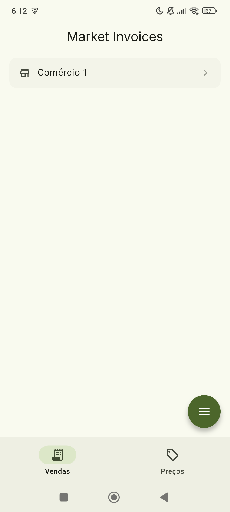
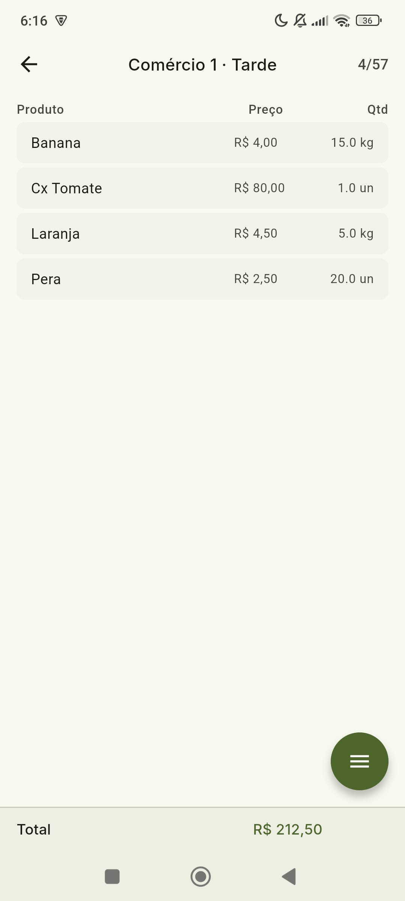
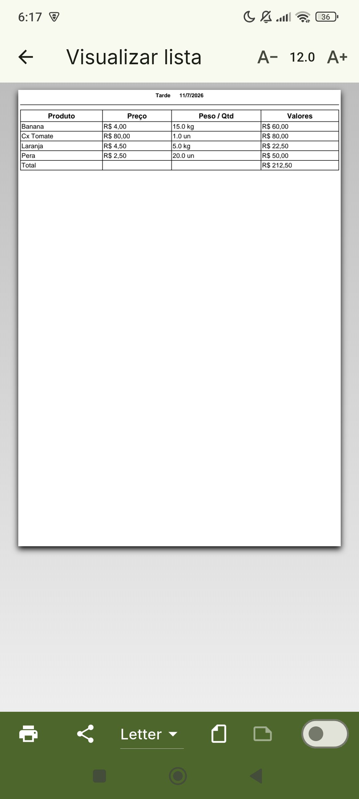
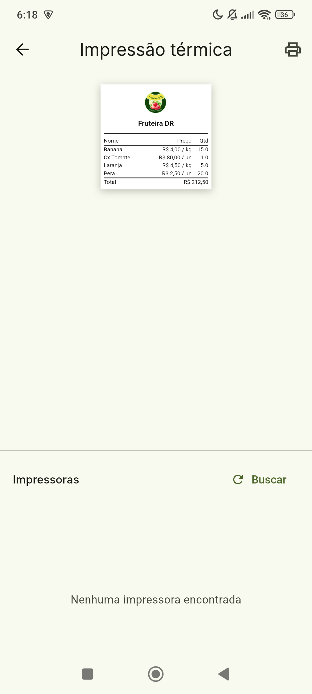
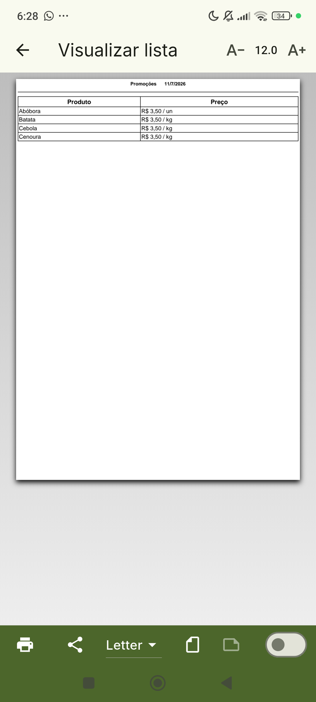

# Market Invoices

A Flutter mobile app for creating, managing, and printing **sales lists** and **price lists** for local markets and small grocery businesses. Data is stored locally in SQLite, so lists work offline and stay on the device.

Built for day-to-day market operations—especially produce retail—where you need quick item entry, clear totals, and printable output for customers or internal use.

---

## Table of Contents

- [Purpose](#purpose)
- [Features](#features)
- [Screenshots](#screenshots)
- [Use Cases](#use-cases)
- [Build & Install](#build--install)
- [Configuration](#configuration)
- [Contributing](#contributing)
- [Author](#author)
- [License](#license)

---

## Purpose

Market Invoices helps sellers and market staff:

- Organize multiple **businesses** (your own store or client stores)
- Create **sales lists** (items with quantity, unit price, and totals)
- Create **price lists** (reference prices per product, by unit or kilogram)
- **Print** lists as PDF documents or send them to **thermal printers**
- **Add products** manually, in bulk, by voice, or with AI-assisted parsing

The app targets a practical workflow: capture what was sold or what prices apply today, then print or share the result—without depending on a backend server for core features.

---

## Features

- **Two list modes:** Sales (`Vendas`) and Prices (`Preços`)
- **Local persistence:** SQLite database with commerce, list, and item tables
- **Product units:** Supports `un` (units) and `kg` (kilograms)
- **Optional product IDs:** Map internal codes to products for faster entry and price tracking
- **Bulk entry:** Paste or describe multiple products at once
- **Voice + AI:** Speech-to-text and Groq-powered parsing for batch product entry (optional)
- **PDF export:** Preview, adjust font size, and print/share lists
- **Thermal printing:** Bluetooth/USB receipt printing with live preview
- **Material 3 UI:** Light/dark theme with a minimal, mobile-first layout

---

## Screenshots

<table align="center">
  <tr>
    <td align="center" width="50%">
      
      <br/>
      <em>Home — switch between Sales and Prices lists</em>
    </td>
    <td align="center" width="50%">
      
      <br/>
      <em>Sales list — items, price, and running total</em>
    </td>
  </tr>
  <tr>
    <td align="center" width="50%">
      
      <br/>
      <em>PDF preview — sales list ready to print</em>
    </td>
    <td align="center" width="50%">
      
      <br/>
      <em>Thermal print — receipt preview and printer discovery</em>
    </td>
  </tr>
  <tr>
    <td align="center" width="50%">
      
      <br/>
      <em>PDF preview — price list with unit (un / kg)</em>
    </td>
    <td width="50%"></td>
  </tr>
</table>

---

## Use Cases

| Scenario | How the app helps |
|----------|-------------------|
| **Daily market sales** | Build a sales list per shift, track weight/units, and print a receipt for the customer |
| **Price board for the day** | Maintain a price list (`Promoções`, seasonal items) and print it for display |
| **Multiple clients / stalls** | Register separate businesses and keep each one's lists isolated |
| **Fast product entry** | Use voice or paste a product description instead of typing each item manually |
| **Repeat customers with product codes** | Enable product IDs to autocomplete names and compare prices across lists |
| **Offline operation** | Core list management works without internet; only AI features need connectivity |

---

## Build & Install

### Prerequisites

- [Flutter SDK](https://docs.flutter.dev/get-started/install) (Dart `^3.5.0`)
- Android SDK (for building APKs)
- A physical device or emulator for testing

### 1. Clone the repository

```bash
git clone https://github.com/mathyc0de/market-invoices-app.git
cd market-invoices-app
```

### 2. Install dependencies

```bash
flutter pub get
```

### 3. Configure environment variables

Create a `.env` file in the project root:

```env
GROQ_API_KEY=your_groq_api_key_here
```

> **Note:** The Groq API key is only required for AI-assisted and voice-based bulk product entry. Manual entry, printing, and local storage work without it.

### 4. Run on a device or emulator

```bash
flutter run
```

### 5. Build a release APK (Android)

```bash
flutter build apk --release
```

The APK will be generated at:

```
build/app/outputs/flutter-apk/app-release.apk
```

Transfer the file to your Android device and install it. You can also download pre-built releases from the [Releases](https://github.com/mathyc0de/market-invoices-app/releases) page when available.

### Development checks

```bash
flutter analyze
flutter test
```

---

## Configuration

| File / setting | Description |
|----------------|-------------|
| `.env` | Stores `GROQ_API_KEY` for AI product parsing |
| `assets/logo.png` | Logo shown on thermal receipts |
| `lib/config/thermal_receipt_config.dart` | Market name, logo path, and paper size (58mm / 80mm) |

---

## Contributing

Contributions are welcome. Whether you want to fix a bug, improve the UI, add documentation, or propose a new feature, follow the steps below.

### How to contribute

1. **Fork** the repository on GitHub
2. **Clone** your fork locally
3. Create a **feature branch** from `main`:
   ```bash
   git checkout -b feature/your-feature-name
   ```
4. Make your changes and keep them focused
5. Run checks before opening a PR:
   ```bash
   flutter analyze
   flutter test
   ```
6. **Commit** with a clear message describing *why* the change was made
7. **Push** to your fork and open a **Pull Request** against `main`
8. Describe what changed, how to test it, and include screenshots for UI updates

### What you can contribute

- Bug fixes and performance improvements
- UI/UX enhancements (especially accessibility and layout)
- Documentation and translations
- Tests for existing behavior
- Printer or device compatibility improvements

### Reporting issues

Open a [GitHub Issue](https://github.com/mathyc0de/market-invoices-app/issues) with:

- Steps to reproduce the problem
- Expected vs. actual behavior
- Device model, Android version, and app version
- Screenshots or logs when relevant

### Code guidelines

- Match existing code style and naming conventions
- Prefer small, focused changes over large refactors
- Avoid changing business logic unless the issue or feature explicitly requires it
- Do not commit secrets (`.env`, API keys, credentials)

---

## Author

**Matheus Silveira** ([@mathyc0de](https://github.com/mathyc0de))

<div align="center">
  <a href="https://github.com/mathyc0de">
    
  </a>
  <br/>
  <sub><b>mathyc0de</b></sub>
</div>

---

## License

This project is licensed under the [Apache License 2.0](LICENSE).
